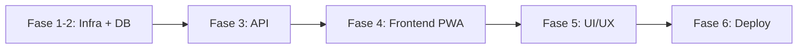

# Tasks: Simulador Ads MVP (v2)

**Input**: Design documents from `specs/001-simulador-ads-mvp/`
**Prerequisites**: plan.md v2 (required), spec.md v2 (required)
**Constitution**: `.specify/memory/constitution.md` v1.0.0
**PRD Version**: v2 (com Sazonalidade, Confidence Score, Saúde dos Dados)

## Format: `[ID] [P?] [Fase] Description`

- **[P]**: Pode rodar em paralelo (arquivos diferentes, sem dependências)
- **[Fase]**: Fase do PRD à qual a tarefa pertence (F1-F6)

---

## Fase 1–2: Infraestrutura, Banco de Dados e Modelagem

**Purpose**: Levantar ambiente Docker, criar projeto Laravel, migrations, models e seeders.
**Skills Obrigatórias**: `@laravel-expert`, `@database-architect`
**⚠️ CRITICAL**: Todas as fases subsequentes dependem desta fase estar 100% concluída.

### Setup do Projeto

- [ ] T001 [F1] Inicializar projeto Laravel via Docker (Sail) com MySQL
  - Comando: `curl -s "https://laravel.build/simulador-ads?with=mysql" | bash`
  - Mover conteúdo para raiz do projeto atual
  - Garantir que `./vendor/bin/sail up -d` suba os containers
- [ ] T002 [F1] Configurar `.env` com credenciais MySQL do Sail
- [ ] T003 [P] [F1] Adicionar entradas ao `.gitignore` (node_modules, .env, vendor)

### Migrations

- [ ] T004 [F2] Criar migration `create_segments_table`:
  - `id`, `name` (string, unique), `avg_ctr` (decimal 5,4), `avg_cpc` (decimal 8,2), `avg_conversion_rate` (decimal 5,4)
  - `confidence_score` (decimal 3,2 — range 0.00 a 1.00) ← **[NEW v2]**
  - `created_at`, `updated_at` — controle de atualização trimestral ← **[NEW v2]**
  - Índice único em `name`
- [ ] T005 [P] [F2] Criar migration `create_regions_table`:
  - `id`, `name` (string, unique), `total_population` (bigInteger), `reachable_audience` (bigInteger), `avg_cpm` (decimal 8,2)
  - `confidence_score` (decimal 3,2 — range 0.00 a 1.00) ← **[NEW v2]**
  - `created_at`, `updated_at` — controle de atualização semestral/anual ← **[NEW v2]**
  - Índice único em `name`
- [ ] T006 [F2] Adicionar campo `role` (enum: user/admin, default 'user') à tabela `users` via migration
- [ ] T007 [F2] Criar migration `create_simulations_table`:
  - `id`, `user_id` (FK), `budget` (decimal 10,2), `payment_type` (string), `campaign_days` (integer), `region_id` (FK), `segment_id` (FK), `goal` (string), `maturity_level` (string)
  - `campaign_month` (tinyInteger 1-12) ← **[NEW v2]** — mês selecionado para sazonalidade
  - `results_json` (json), `created_at`
  - Índices em `user_id`, `region_id`, `segment_id`

### Models e Relationships

- [ ] T008 [P] [F2] Criar Model `Segment` em `app/Models/Segment.php`:
  - fillable: name, avg_ctr, avg_cpc, avg_conversion_rate, confidence_score
  - Validação via accessor: `confidence_score` clampado a 0.0–1.0
- [ ] T009 [P] [F2] Criar Model `Region` em `app/Models/Region.php`:
  - fillable: name, total_population, reachable_audience, avg_cpm, confidence_score
- [ ] T010 [F2] Criar Model `Simulation` em `app/Models/Simulation.php`:
  - fillable + casts: results_json → array, campaign_month → integer
  - belongsTo: User, Segment, Region
- [ ] T011 [F2] Atualizar Model `User`:
  - hasMany: Simulations
  - Accessor para `isAdmin`

### Seeders

- [ ] T012 [P] [F2] Criar `SegmentSeeder` com 10+ segmentos:
  - Saúde, Imobiliário, E-commerce Moda, SaaS B2B, Educação Online, Alimentação, Automotivo, Finanças, Turismo, Fitness
  - Cada segmento com `confidence_score = 0.7` ← **[NEW v2]**
- [ ] T013 [P] [F2] Criar `RegionSeeder` com 27 estados brasileiros:
  - Dados de população IBGE, público alcançável (70-80%), CPM estimado
  - Cada região com `confidence_score = 0.7` ← **[NEW v2]**
- [ ] T014 [F2] Registrar seeders no `DatabaseSeeder.php` + executar:
  - `./vendor/bin/sail artisan db:seed`

**Checkpoint F1-2**: ✅ Validar com `./vendor/bin/sail artisan tinker`:
- `Segment::count() >= 10` e `Segment::first()->confidence_score === 0.7`
- `Region::count() >= 27` e `Region::first()->confidence_score === 0.7`

---

## Fase 3: Backend da API e Lógica de Negócios

**Purpose**: API RESTful completa com autenticação, endpoints de dados e lógica modular.
**Skills Obrigatórias**: `@laravel-expert`, `@uncle-bob-craft` (Clean Code)

### Autenticação (Sanctum)

- [ ] T015 [F3] Instalar e configurar Laravel Sanctum:
  - `./vendor/bin/sail composer require laravel/sanctum`
- [ ] T016 [F3] Criar `RegisterController` com validação (name, email, password)
- [ ] T017 [P] [F3] Criar `LoginController` com autenticação via Sanctum token
- [ ] T018 [F3] Registrar rotas de auth em `routes/api.php`: POST /register, /login, /logout

### Endpoints da Aplicação

- [ ] T019 [F3] Criar `ParameterController@index`:
  - `GET /api/parameters` → retorna segments (com confidence_score) + regions (com confidence_score) agrupados
- [ ] T020 [F3] Criar `SimulationController@store`:
  - `POST /api/simulations` — recebe payload JSON incluindo `campaign_month` ← **[NEW v2]**
- [ ] T021 [P] [F3] Criar `SimulationController@index`:
  - `GET /api/simulations` — histórico ordenado por data

### SimulationService (Clean Code)

- [ ] T022 [F3] Criar `SimulationService` em `app/Services/`:
  - `calculateNetBudget(float $gross, bool $deductTax): float`
  - `getSeasonalityMultiplier(int $month): float` ← **[NEW v2]**
    - Nov(11) → 1.5, Dec(12) → 1.3, Jan(1) → 0.85, demais → 1.0
  - `adjustCostsForSeason(float $cpm, float $cpc, int $month): array` ← **[NEW v2]**
  - `applyMaturityMultiplier(float $ctr, float $convRate, string $level): array`
  - `calculateMetrics(float $budget, float $cpm, float $ctr, float $convRate): array`
  - `generateScenarios(array $baseMetrics): array` (×0.8, ×1.0, ×1.3)

### Módulo Admin (Import + Saúde dos Dados)

- [ ] T023 [F3] Criar Middleware `IsAdmin` verificando `$request->user()->role === 'admin'`
- [ ] T024 [F3] Criar `ImportController@importSegments`:
  - `POST /api/admin/import/segments` — valida colunas obrigatórias: name, avg_ctr, avg_cpc, avg_conversion_rate, **confidence_score** ← **[NEW v2]**
  - Validar `confidence_score` no range 0.0–1.0; rejeitar linhas fora do range
  - Upsert por name
- [ ] T025 [P] [F3] Criar `ImportController@importRegions`:
  - `POST /api/admin/import/regions` — colunas: name, total_population, reachable_audience, avg_cpm, **confidence_score** ← **[NEW v2]**
  - Validar `confidence_score` no range 0.0–1.0
- [ ] T026 [F3] Criar `ImportService` em `app/Services/`:
  - Validação de colunas obrigatórias (incluindo confidence_score)
  - Validação de range para confidence_score
  - Parser CSV/Excel (Maatwebsite/Laravel-Excel ou parser nativo)
- [ ] T027 [F3] Criar `DataHealthService` em `app/Services/` ← **[NEW v2]**:
  - `getSegmentsHealth()`: retorna { last_updated, days_since_update, avg_confidence_score, is_stale (> 90 dias) }
  - `getRegionsHealth()`: retorna { last_updated, days_since_update, avg_confidence_score, is_stale (> 180 dias) }
  - `getOverallStatus()`: agrega status geral (healthy/warning/critical)
- [ ] T028 [F3] Criar `ImportController@dataHealth` ← **[NEW v2]**:
  - `GET /api/admin/data-health` — retorna status de saúde via DataHealthService
- [ ] T029 [F3] Registrar todas as rotas admin em `routes/api.php` protegidas pelo middleware IsAdmin:
  - Incluir `GET /api/admin/data-health` ← **[NEW v2]**

**Checkpoint F3**: ✅ Testar com Postman/Insomnia:
- register → login → GET /parameters (confidence_score presente) → POST /simulations (com campaign_month)
- GET /admin/data-health retorna status e avg_confidence_score

---

## Fase 4: Setup do Frontend (Vue.js PWA) e Motor de Cálculo Local

**Purpose**: Configurar Vue.js como PWA com Vite, implementar motor de cálculo completo no Pinia, INCLUINDO Sazonalidade.
**Skills Obrigatórias**: `@vue3-composition-api`, `@tailwind-master`

### ⚡ CHECKLIST RIGOROSO — Fase 4

> Cada item DEVE ser verificado e marcado antes de avançar para a Fase 5.
> Nenhum componente de UI pode ser criado até que este checklist esteja 100%.

#### 4.1 Setup Vue.js + Vite

- [ ] T030 [F4] Instalar Vue.js 3, Vue Router, Pinia via Sail:
  ```bash
  ./vendor/bin/sail npm install vue@3 vue-router@4 pinia
  ```
- [ ] T031 [F4] Instalar e configurar Vite para Laravel:
  ```bash
  ./vendor/bin/sail npm install @vitejs/plugin-vue
  ```
  - Configurar `vite.config.js` com alias `@` para `resources/js`
- [ ] T032 [F4] Criar ponto de entrada `resources/js/app.js` com createApp, use(router), use(pinia)
- [ ] T033 [F4] Criar `resources/js/router/index.js` com rotas: `/login`, `/dashboard`, `/admin`, `/history`
  - Guards de navegação: redirecionar para /login se não autenticado

**☑ GATE 4.1**: Executar `./vendor/bin/sail npm run dev` → Vue renderiza sem erros no console.

#### 4.2 Tailwind CSS (via DESIGN.md)

- [ ] T034 [F4] Instalar Tailwind CSS via Sail:
  ```bash
  ./vendor/bin/sail npm install -D tailwindcss postcss autoprefixer
  ./vendor/bin/sail npx tailwindcss init -p
  ```
- [ ] T035 [F4] Configurar `tailwind.config.js` com TODOS os tokens do DESIGN.md:
  - Cores: primary (#0668E1), on-surface (#191b23), surface-container-low (#f2f3fe), error (#ba1a1a), sucesso (#0f5223/#d8f5e1), etc.
  - borderRadius: DEFAULT 1rem, lg 2rem, xl 3rem, full 9999px
  - fontFamily: headline [Manrope], body [Inter]
- [ ] T036 [F4] Criar `resources/js/assets/css/app.css` com:
  - `@tailwind base; @tailwind components; @tailwind utilities;`
  - Classes: `.glass-panel`, `.gradient-button`, `.editorial-shadow`, `.glass-metric`
  - Google Fonts (Manrope + Inter + Material Symbols Outlined) no blade
- [ ] T037 [F4] Verificar `resources/views/app.blade.php` com `@vite` e div #app

**☑ GATE 4.2**: Classes Tailwind do DESIGN.md (ex: `bg-surface-container-low`, `text-primary`) funcionam sem erros.

#### 4.3 Configuração PWA

- [ ] T038 [F4] Instalar plugin PWA do Vite:
  ```bash
  ./vendor/bin/sail npm install -D vite-plugin-pwa
  ```
- [ ] T039 [F4] Configurar `vite-plugin-pwa` no `vite.config.js`:
  - `registerType: 'autoUpdate'`
  - Manifest: name "Simulador Ads", theme_color "#0668E1", background_color "#faf9ff", display "standalone"
  - Workbox: cache-first para assets, network-first para API
- [ ] T040 [P] [F4] Criar ícones PWA (192x192, 512x512) em `public/icons/`
- [ ] T041 [F4] Verificar Service Worker cacheando assets e lógica JS

**☑ GATE 4.3**: Chrome DevTools → Application → Manifest correto. Service Worker registrado.

#### 4.4 Motor de Cálculo (Pinia Stores + Composables)

- [ ] T042 [F4] Criar composable `useSeasonality` em `resources/js/composables/` ← **[NEW v2]**:
  - **Constantes**:
    ```js
    const SEASONALITY_MULTIPLIERS = {
      1: 0.85,   // Janeiro (Ressaca Comercial)
      2: 1.0, 3: 1.0, 4: 1.0, 5: 1.0, 6: 1.0,
      7: 1.0, 8: 1.0, 9: 1.0, 10: 1.0,
      11: 1.5,   // Novembro (Black Friday)
      12: 1.3,   // Dezembro (Natal)
    }
    ```
  - **Função `getMultiplier(month: number): number`**
  - **Função `getSeasonLabel(month: number): string`** — retorna "Black Friday", "Natal", "Ressaca Comercial" ou "Normal"
  - **Função `isHighSeason(month: number): boolean`** — true se month === 11 ou 12

- [ ] T043 [F4] Criar composable `useCalculator` em `resources/js/composables/`:
  - **Pipeline de cálculo (ordem estrita)**:
    1. **`calculateNetBudget(grossBudget, taxEnabled)`**:
       - Se taxEnabled: `grossBudget * (1 - 0.1215)`
       - Senão: `grossBudget`
    2. **`applySeasonality(cpm, cpc, month)`** ← **[NEW v2]**:
       - `adjustedCpm = cpm * getMultiplier(month)`
       - `adjustedCpc = cpc * getMultiplier(month)`
       - Retorna `{ cpm: adjustedCpm, cpc: adjustedCpc }`
    3. **`applyMaturityMultiplier(baseCtr, baseConvRate, maturityLevel)`**:
       - Iniciante: `{ ctr: baseCtr * 0.85, convRate: baseConvRate * 0.85 }`
       - Intermediário: `{ ctr: baseCtr, convRate: baseConvRate }`
       - Avançado: `{ ctr: baseCtr * 1.10, convRate: baseConvRate * 1.10 }`
    4. **`calculateMetrics(budget, adjustedCpm, adjustedCtr, adjustedConvRate)`**:
       - `impressions = (budget / adjustedCpm) * 1000`
       - `clicks = impressions * adjustedCtr`
       - `leads = clicks * adjustedConvRate`
       - `cpa = budget / leads` (guard: leads > 0)
    5. **`generateScenarios(budget, adjustedCpm, adjustedCtr, adjustedConvRate)`**:
       - Conservador: métricas com CTR × 0.8, ConvRate × 0.8
       - Realista: métricas com CTR × 1.0, ConvRate × 1.0
       - Otimista: métricas com CTR × 1.3, ConvRate × 1.3

- [ ] T044 [F4] Criar `useParameterStore` em `resources/js/stores/`:
  - State: `segments: []`, `regions: []`, `loaded: false`
  - Action: `fetchParameters()` → GET /api/parameters (com confidence_score)
  - Getters: `getSegmentById(id)`, `getRegionById(id)`

- [ ] T045 [F4] Criar `useAuthStore` em `resources/js/stores/`:
  - State: `user: null`, `token: null`, `isAuthenticated: boolean`
  - Actions: `register()`, `login()`, `logout()`, `fetchUser()`

- [ ] T046 [F4] Criar `useSimulationStore` em `resources/js/stores/`:
  - State: `grossBudget`, `taxEnabled`, `campaignDays`, `regionId`, `segmentId`, `goal`, `maturityLevel`,
    `campaignMonth` (default: mês atual) ← **[NEW v2]**,
    `scenarios: { conservative: {}, realistic: {}, optimistic: {} }`
  - Getters computados (todos reativos):
    - `netBudget` — aplica dedução tributária
    - `seasonalCosts` — aplica multiplicador sazonal ao CPM/CPC ← **[NEW v2]**
    - `adjustedMetrics` — aplica maturidade ao CTR/ConvRate
    - `scenarios` — gera 3 cenários usando pipeline completo
    - `seasonLabel` — "Black Friday", "Natal", etc. ← **[NEW v2]**
  - Actions:
    - `saveSimulation()` → POST /api/simulations (com campaign_month)
    - `loadHistory()` → GET /api/simulations

- [ ] T047 [F4] Criar composable `useAlerts` em `resources/js/composables/`:
  - Gatilhos condicionais:
    - `budgetTooLow`: netBudget < (adjustedCpm × 1000 × 3)
    - `periodTooShort`: campaignDays < 14
    - `audienceTooSmall`: reachable_audience < 50.000
    - `highSeasonWarning`: month === 11 || month === 12 ← **[NEW v2]**
      - Mensagem: "Sazonalidade Intensa: custos de mídia aumentados em {X}% para {seasonLabel}"

**☑ GATE 4.4**: Teste manual no console:
1. `generateScenarios(5000, 25, 0.018, 0.025)` → 3 objetos com valores distintos ✓
2. `applySeasonality(25, 2.5, 11)` → `{ cpm: 37.5, cpc: 3.75 }` ✓
3. `calculateNetBudget(10000, true)` → `8785` ✓
4. Pipeline completo: tributação + sazonalidade Nov + maturidade Iniciante → valores menores que sem ajustes ✓

#### 4.5 Validação Final da Fase 4

- [ ] T048 [F4] **VALIDAÇÃO DE INTEGRAÇÃO**: Montar página temporária de teste que:
  - Carrega parameters do backend (com confidence_score)
  - Exibe inputs: orçamento, toggle impostos, seletor de mês ← **[NEW v2]**
  - Ao digitar, os 3 cenários recalculam em tempo real no console
  - Toggle de impostos altera valores (dedução 12,15%)
  - Seletor de mês altera CPM/CPC (Nov → ×1.5, Dez → ×1.3, Jan → ×0.85) ← **[NEW v2]**
  - Multiplicador de maturidade altera CTR e Conv Rate

**☑ GATE FINAL FASE 4**: Todos os 4 gates anteriores passam. Pipeline completo (Tributação → Sazonalidade → Maturidade → Cenários) funciona isoladamente.

---

## Fase 5–5.5: UI/UX Reativa e Módulo Admin

**Purpose**: Componentes Vue extraídos dos HTMLs Stitch, integração com Pinia, módulo Admin com Saúde dos Dados.
**Skills Obrigatórias**: `@vue3-composition-api`, `@frontend-accessibility`

### ⚡ CHECKLIST RIGOROSO — Fase 5

> Cada componente DEVE seguir a ordem:
> 1. Abrir HTML Stitch correspondente
> 2. Ler DESIGN.md para tokens
> 3. Extrair classes Tailwind
> 4. Converter para Vue
> 5. Integrar com Pinia
> 6. Verificar fidelidade visual

#### 5.1 Tela de Login (Fonte: `_references/stitch/login.html`)

- [ ] T049 [F5] Criar `LoginForm.vue` extraído de `login.html` linhas 162-204:
  - Input e-mail com ícone `mail`
  - Input senha com ícone `lock` e toggle visibilidade
  - Botão "Criar conta grátis" com `gradient-button`
  - Divisor "ou" + botão Google (visual apenas)
  - Footer "Já possui conta? Fazer login"
  - Integrar com `useAuthStore.register()` e `.login()`
- [ ] T050 [F5] Criar `LoginPage.vue` layout Split View:
  - Esquerda (55%): gradiente primary, badge "Inteligência Preditiva", card glass decorativo
  - Direita (45%): LoginForm centralizado sobre bg-surface
  - Responsivo: esquerda `hidden md:flex`

**☑ GATE 5.1**: Login visualmente idêntico ao Stitch. Fluxo register → login → /dashboard funciona.

#### 5.2 Componentes de Layout

- [ ] T051 [P] [F5] Criar `TopAppBar.vue` de `dashboard.html` linhas 94-114:
  - Logo, nav links, ícones, botão "Nova Simulação", avatar usuário
  - `bg-white/80 backdrop-blur-xl`
- [ ] T052 [P] [F5] Criar `AdminSidebar.vue` de `admin.html` linhas 91-131:
  - Logo + badge "Admin Console", nav links, footer
  - `bg-slate-50`, `w-64`, `fixed left-0`
- [ ] T053 [P] [F5] Criar `BottomNavBar.vue` de `admin.html` linhas 255-268:
  - 3 botões (Início, Importar, Admin), `md:hidden fixed bottom-0`

**☑ GATE 5.2**: Layout renderiza em desktop e mobile.

#### 5.3 Dashboard: Painel de Parâmetros (Fonte: `dashboard.html`)

- [ ] T054 [F5] Criar `ParameterPanel.vue` de `dashboard.html` linhas 118-196:
  - Input "Orçamento Total (R$)" → `v-model: useSimulationStore.grossBudget`
  - Select "Tipo de Conta 2026" (Pré-paga PIX / Pós-paga Cartão)
  - Grid 2 cols: Input "Período (Dias)" + Select "Região" → `useParameterStore.regions`
  - Select "Segmento de Mercado" → `useParameterStore.segments`
  - **Dropdown "Mês Previsto da Campanha"** (Janeiro–Dezembro) → `v-model: useSimulationStore.campaignMonth` ← **[NEW v2]**
    - Exibir badge sazonal ao lado (ex: "🔥 Black Friday +50%") se mês for Nov/Dec/Jan
  - Radio group "Objetivo" (Tráfego, Leads, Conversões)
  - Radio group "Maturidade" (Iniciante, Intermediário, Avançado)
  - Toggle "Deduzir Impostos (12,15%)" → `v-model: useSimulationStore.taxEnabled`
  - Botão "Simular Resultados"

**☑ GATE 5.3**: Cada campo conectado ao Pinia. Alterar seletor de mês reflete nos cálculos imediatamente.

#### 5.4 Dashboard: Área de Resultados

- [ ] T055 [F5] Criar `BudgetSummaryCard.vue` de `dashboard.html` linhas 214-234:
  - Gradiente primary-container
  - Grid 3 cols: Orçamento Bruto | Dedução Tributária | Orçamento Real (Líquido)
  - **Linha extra**: "Ajuste Sazonal: {seasonLabel} (×{multiplier})" ← **[NEW v2]**
  - Valores reativos de `useSimulationStore`
- [ ] T056 [F5] Criar `ScenarioCard.vue` (reutilizável) de `dashboard.html` linhas 237-323:
  - Props: `type` (conservative|realistic|optimistic), `data` (métricas)
  - Cores dinâmicas por tipo:
    - Conservador: `bg-red-50/50`, `border-red-100`
    - Realista: `bg-yellow-50/50`, `border-yellow-100`, `ring-2 ring-yellow-400/20`
    - Otimista: `bg-emerald-50/50`, `border-emerald-100`
  - Badge cenário + Métricas: Impressões, Cliques, Leads, CPA
- [ ] T057 [F5] Criar `AlertBanner.vue` de `dashboard.html` linhas 326-353:
  - Props: `type` (warning|tip|season), `title`, `description`
  - Tipo `season` com cor laranja para alertas de sazonalidade ← **[NEW v2]**
  - Integrado com `useAlerts`
- [ ] T058 [P] [F5] Criar `MetricGlassCard.vue` de `dashboard.html` linhas 354-364:
  - Overlay gradiente, glass-metric card com "Alcance Estimado Total" reativo
- [ ] T059 [F5] Criar botões de exportação (Excel, PDF, PNG) — UI apenas

**☑ GATE 5.4**: 3 ScenarioCards com valores diferentes. Mudar mês para Nov → todos recalculam com CPM/CPC ×1.5.

#### 5.5 Dashboard: Montagem da Página

- [ ] T060 [F5] Montar `DashboardPage.vue` com layout `grid-cols-1 lg:grid-cols-[35%_65%]`:
  - Esquerda: `ParameterPanel.vue`
  - Direita: exportação + `BudgetSummaryCard` + 3× `ScenarioCard` + `AlertBanner`(s) + `MetricGlassCard`
  - `onMounted`: carregar `useParameterStore.fetchParameters()`

**☑ GATE 5.5**: Dashboard completo, fiel ao Stitch, cálculos em tempo real INCLUINDO sazonalidade.

#### 5.6 Módulo Admin (Fonte: `_references/stitch/admin.html`)

- [ ] T061 [F5] Criar `UploadZone.vue` de `admin.html` linhas 179-186:
  - Drag & Drop com `border-dashed`, ícone `cloud_upload`, hover animation
  - Input file invisível, emits `@fileSelected(file)`
- [ ] T062 [F5] Criar `ImportCard.vue` de `admin.html` linhas 169-197:
  - Props: title, description, templateUrl, uploadEndpoint
  - Inclui: UploadZone + StatusBanner + botão "Importar"
  - Template de download DEVE incluir coluna `confidence_score` ← **[NEW v2]**
- [ ] T063 [P] [F5] Criar `StatusBanner.vue` de `admin.html` linhas 188-221:
  - Props: type (success|error), message
  - Sucesso: `bg-emerald-50`, check verde | Erro: `bg-error-container/40`, ícone vermelho
- [ ] T064 [F5] Criar `DataHealthPanel.vue` ← **[NEW v2]**:
  - Buscar dados de `GET /api/admin/data-health`
  - Cards para cada tabela (Segments e Regions):
    - Última atualização: "Atualizado há X dias"
    - Status: 🟢 Saudável (< prazo) | 🟡 Atenção (próximo do prazo) | 🔴 Desatualizado (> prazo)
    - Prazos: Segments > 90 dias = stale, Regions > 180 dias = stale
    - Média do confidence_score com indicador visual:
      - ≥ 0.7: Verde "Alta confiabilidade"
      - 0.5–0.69: Amarelo "Confiabilidade moderada"
      - < 0.5: Vermelho "Confiabilidade baixa"
  - Design: glass-panel com tokens do DESIGN.md
- [ ] T065 [F5] Criar `IntegrityFooter.vue` de `admin.html` linhas 229-250:
  - Pills: Média CPM, Média CTR, Total Regiões, **Média Confidence Score** ← **[NEW v2]**
  - Dados computados de `useParameterStore`
- [ ] T066 [F5] Montar `AdminPage.vue`:
  - Layout: AdminSidebar (esquerda) + conteúdo (direita)
  - Header glass com badge "Admin Panel"
  - **DataHealthPanel.vue** no topo ← **[NEW v2]**
  - Grid 2 colunas: 2× ImportCard (Segmentos + Regiões)
  - Footer: IntegrityFooter
  - Guard de rota: redirect /dashboard se `user.role !== 'admin'`

**☑ GATE 5.6**: Upload funcional. DataHealthPanel exibe status correto e alertas de dados desatualizados.

#### 5.7 Página de Histórico

- [ ] T067 [F5.5] Criar `HistoryPage.vue`:
  - Lista de simulações ordenadas por data
  - Cada item: data, orçamento, segmento, **mês da campanha** ← **[NEW v2]**, cenário realista resumido
  - Design: cards surface-container-lowest, sombras editoriais

**☑ GATE 5.7**: Histórico lista simulações com mês da campanha visível.

#### 5.8 Validação Final da Fase 5

- [ ] T068 [F5.5] **TESTE DE FIDELIDADE VISUAL**: Para cada tela (Login, Dashboard, Admin):
  1. Abrir HTML Stitch e tela Vue lado a lado
  2. Verificar cores, fontes, espaçamentos, bordas e sombras idênticas
  3. Documentar divergências e corrigir
- [ ] T069 [F5.5] **TESTE DO FLUXO COMPLETO**:
  1. Register → Login → Dashboard
  2. Preencher parâmetros → Selecionar mês "Novembro" ← **[NEW v2]**
  3. Verificar: CPM/CPC inflados ×1.5, alerta "Sazonalidade Intensa" visível
  4. Ativar toggle impostos → Valores recalculam com líquido
  5. Mudar maturidade → CTR/ConvRate mudam
  6. Salvar → Histórico → Simulação com mês "Novembro" listada
  7. Admin → DataHealthPanel exibe status ← **[NEW v2]**
  8. Upload CSV (com confidence_score) → Feedback exibido
  9. Voltar Dashboard → Dados atualizados

**☑ GATE FINAL FASE 5**: 3 telas fidedignas ao Stitch. Fluxo end-to-end com sazonalidade e saúde dos dados funcional.

---

## Fase 6: Segurança, Auditoria e Deploy

**Purpose**: Hardening de segurança, auditoria PWA e preparação para deploy.
**Skills Obrigatórias**: `@security-review`, `@web-performance`

### Segurança

- [ ] T070 [P] [F6] Validar uploads CSV no ImportService:
  - Tipo MIME (text/csv, application/vnd.ms-excel)
  - Tamanho máximo 5MB, extensão (.csv, .xlsx)
  - `confidence_score` no range 0.0–1.0 (rejeitar fora do range) ← **[NEW v2]**
- [ ] T071 [P] [F6] Rate limiting: `/api/login` (5/min), `/api/admin/import/*` (10/min)
- [ ] T072 [F6] CSRF protection + sanitização em todos os FormRequests
- [ ] T073 [F6] Revisar que rotas admin são inacessíveis sem middleware IsAdmin

### Auditoria PWA

- [ ] T074 [F6] Lighthouse PWA audit (score ≥ 90)
  - Manifest, Service Worker, HTTPS, ícones
- [ ] T075 [F6] Testar offline: desconectar → interface carrega → cálculos funcionam

### Build e Deploy

- [ ] T076 [F6] Build produção: `./vendor/bin/sail npm run build`
- [ ] T077 [F6] Verificar assets em `public/build/`
- [ ] T078 [F6] Documentar script de deploy (CloudPanel):
  ```bash
  git pull origin main
  composer install --no-dev --optimize-autoloader
  npm install && npm run build
  php artisan migrate --force
  php artisan config:cache
  php artisan route:cache
  ```
- [ ] T079 [F6] Criar usuário admin via seeder/tinker para produção

**Checkpoint Final F6**: ✅ Build passa, PWA auditada, segurança verificada.

---

## Dependencies & Execution Order

### Phase Dependencies



### Parallel Opportunities

| Tarefas paralelas | Razão |
|-------------------|-------|
| T004 + T005 | Migrations independentes (segments/regions) |
| T008 + T009 | Models independentes |
| T012 + T013 | Seeders independentes |
| T051 + T052 + T053 | Componentes de layout sem deps |
| T058 + T059 | MetricGlass e botões export |
| T070 + T071 | Regras de segurança independentes |

---

## Changelog v1 → v2

| Área | Mudança | Tarefas impactadas |
|------|---------|-------------------|
| Sazonalidade do Leilão | Nova funcionalidade (PRD §3.3): multiplicadores mensais sobre CPM/CPC | T042, T043, T046, T047, T054, T055, T057, T069 |
| Confidence Score | Novo campo em segments e regions (PRD §4) | T004, T005, T008, T009, T012, T013, T019, T024, T025, T026, T062, T065, T070 |
| Saúde dos Dados | Novo painel admin (PRD §7 Fase 5.5) | T027, T028, T029, T064, T066 |
| Campaign Month | Novo campo em simulations (PRD §4) | T007, T010, T020, T046, T054, T067 |
| Renumeração PRD | Funcionalidades 1-7 (antes 1-6) | Ajuste global de referências |
| Skills Obrigatórias | Cada fase agora lista skills requeridas (PRD §7) | Headers de cada fase |

---

## Notes

- [P] tasks = arquivos diferentes, sem dependências
- [F?] label mapeia à fase do PRD
- Comandos DEVEM ser prefixados com `./vendor/bin/sail` (Princípio I)
- Tailwind exclusivamente via DESIGN.md e _references/stitch/ (Princípio III)
- Toggle impostos DEVE usar Orçamento_Líquido (Princípio II)
- Pipeline: Tributação → Sazonalidade → Maturidade → Cenários (FR-007)
- PWA desde Fase 4 (Princípio IV)
- **Total: 79 tarefas** distribuídas em 6 fases
